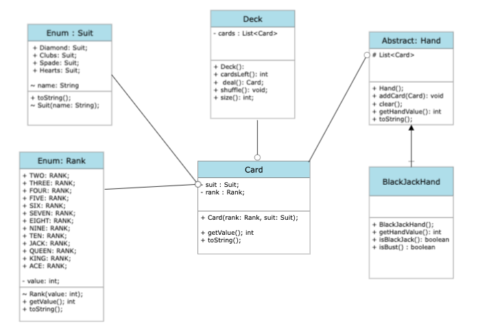

## Black Jack Casino

## Description
Simple game of Black Jack!

## Team Members

- David
- Henry
- Ty'Reik

## Rules

1. Ace 1/11
2. 52 card deck
3. Dealer must continue to drop cards if total is 16 or less
4. Closest hand to 21 wins! 

## UML

## User Story

•	As a user, I want to start a game of blackjack. 

	Blackjack is a friendly card game played between the Player(user) and Dealer.
	Each Card is assigned a numerical value, the goal of the game is for a hand to add up to 21.
	The game begins with the creation of a deck, containing 52 unique cards
	The deck is shuffled, randomizing the cards.
	The Dealer deals two cards to itself and the Player.

•	As a user, I want to hit or stay. 

    The Player is shown the sum of their cards and is offered two options
	Option 1: Hit, adds another card to the hand
	Option 2: Stay, holds the current hand, and shifts to the dealers turn

•	As a user, I choose to stay.
    
    the Dealer begins their turn
	The Dealer must draw cards until the hands sum is greater than 16

•	As a User, I want to see who wins.

	If at any point a hands value is greater than 21, the hand results in a loss
	After the Player and dealer turns, the 2 hands are compared, the hand closest to 21 is the winner
    The player has the option to begin another game

